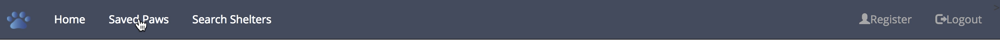

# PAWS Finder: Where Pets And Wonderful Shelters Are Just A Click Away! 

PAWS Finder is the 4 week project that I completed during my time as a software engineer fellow at Hackbright Academy. This full stack web application allows you to quickly search for an adoptable dog or cat from a shelter near you.  With PAWS Finder, registered users can quickly find their ideal dog or cat by entering criteria such as location (zip code, or city/state), gender, size, breed, and age.  Searches can be saved and retrieved at a later time enabling you to get the most updated information.  Want to know which shelters are near you?  Simply enter a zip code and all shelters with adoptable pets will be displayed via Google Maps complete with an info window that displays links to available pets and contact information.  With PAWS Finder you get the most-up-to date adoptable pet and shelter information anytime and anywhere.

##Contents
* [Technologies](#technologies)
* [Features](#features)
* [Installation](#install)
* [About Me](#about)

## <a name="technologies"></a>Technologies
<b>Backend:</b> Python, Flask, PostgreSQL, SQLAlchemy<br/>
<b>Frontend:</b> JavaScript, jQuery, AJAX, Jinja2, Bootstrap, HTML5, CSS3<br/>
<b>APIs:</b>Petfinder, Google, ZIPCode<br/>


## <a name="features"></a>Features
Users can do a quick search without creating an account.  However, all users are encouraged to register as they can use all of the features that I will go through in the following sections.    

Once logged in, users can search for adoptable dogs or cats using more criteria such as size, age, and breed.


Users can save their searches and also "like" pets.  Liked pets have a green heart button next to their information. Liked pets are saved along with the search criteria.   


To retrieve a saved search, users click on the "Saved Paws" link. 



A modal window displays their saved searches. 


Clicking on the saved search shows the most up-to-date information.  Notice that previous likes are still displayed as well. 


Clicking on the Search Shelters link allows a user to search for shelters via a zipcode. 


If a user is interested in a specific shelter, they can use the "Contact us" link to send them an email.


Clicking on the "See our pets" link, users can view the pets that are available in a particular shelter. 


## <a name="install"></a>Installation
To run PAWS Finder:

Install PostgreSQL (Mac OSX)

Clone or fork this repo:

```
https://github.com/glitton/petfinder_project
```

Create and activate a virtual environment inside your Recruiter directory:

```
virtualenv env
source env/bin/activate
```

Install the dependencies:

```
pip install -r requirements.txt
```
Sign up to use the Petfinder API (https://www.petfinder.com/developers/api-key)

Get a Google MAPS API key (https://developers.google.com/maps/documentation/javascript/get-api-key)

Sign up to get a ZIP Code API key (https://www.zipcodeapi.com/API)

Save your API keys in a file called <kbd>secrets.sh</kbd> using this format:
```
export APP_ID="YOUR_KEY_GOES_HERE"
```
Source your keys from your secrets.sh file into your virtual environment:

```
source secrets.sh
```

Set up the database:

```
python model.py
```

Run the app:

```
python server.py
```

You can now navigate to 'localhost:5000/' to access PAWS Finder.

## <a name="about"></a>About Me

Hi, my name is [Generosa Litton](https://www.linkedin.com/in/glitton) and I am a software engineer. Previously, I was a high-tech marketing director.  I am an engineer at heart, having BS in Electronics Engineering, I decided to add to my toolbox by training as a software engineer at Hackbright Academy. I live in the San Francisco Bay Area and I'm currently seeking a full-time software engineer or sales/solutions engineer role. If you'd like to discuss how I can contribute to your organization, feel free to email generosa.litton@yahoo.com.  Thank you!


